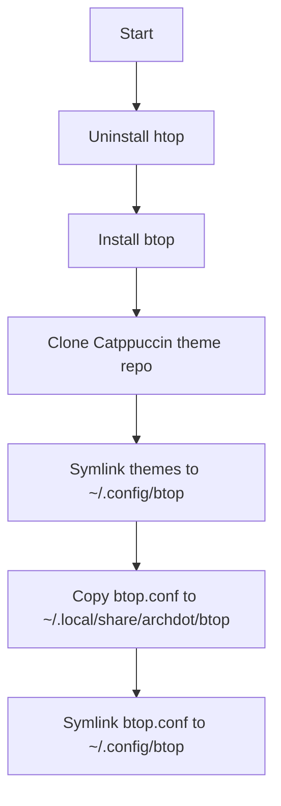

# btop

Resource monitor that replaces htop.

## Process

```mermaid
flowchart TD
    A[Start] --> B[Uninstall htop]
    B --> C[Install btop]
    C --> D[Clone Catppuccin theme repo]
    D --> E[Symlink themes to ~/.config/btop]
    E --> F[Copy btop.conf to ~/.local/share/archdot/btop]
    F --> G[Symlink btop.conf to ~/.config/btop]
```
