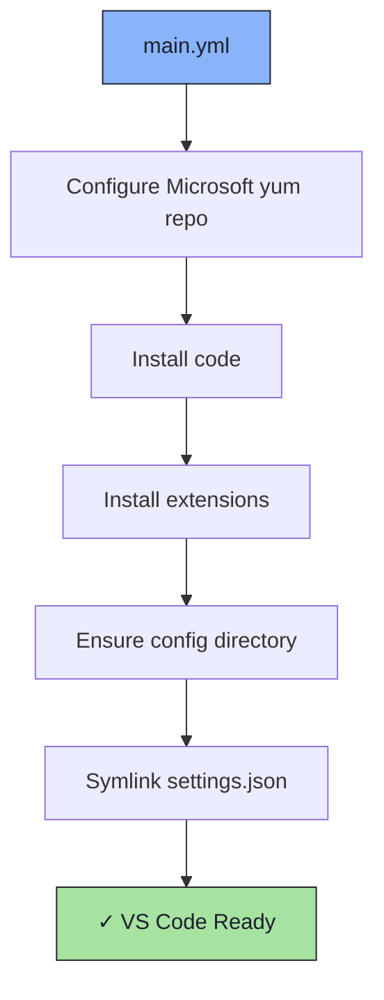

# 💻 Code Role

An Ansible role for installing and configuring [Visual Studio Code](https://code.visualstudio.com/) with extensions and a custom settings configuration.

## 📦 What Gets Installed

### Packages
- `code` - Visual Studio Code (via Microsoft yum repository)

### Extensions
- `Catppuccin.catppuccin-vsc-pack` - Catppuccin color theme pack
- `edwinhuish.better-comments-next` - Improved comment highlighting
- `oderwat.indent-rainbow` - Indentation colorization
- `tyriar.sort-lines` - Line sorting utilities
- `arthurlobo.easy-codesnap` - Code screenshot tool
- `bierner.color-info` - CSS color information
- `donjayamanne.git-extension-pack` - Git tooling pack
- `vscodevim.vim` - Vim keybindings
- `donjayamanne.python-extension-pack` - Python development tools
- `vscjava.vscode-java-pack` - Java development tools

### Configuration Files
- `~/.config/Code/User/settings.json` - Editor settings

## 🏗️ Role Architecture



## 📚 Dependencies

No role dependencies.

**Variables** (override via `group_vars` or extra vars):
- `vscode_extensions` - list of extension IDs to install (defaults defined in `defaults/main.yml`)

## 🚀 Usage

```bash
ansible-playbook main.yml -t code
```
