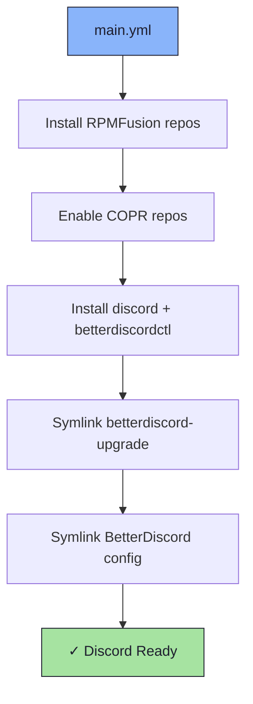

# 💬 Discord Role

An Ansible role for installing [Discord](https://discord.com/) with [BetterDiscord](https://betterdiscord.app/) support and a custom configuration.

## 📦 What Gets Installed

### Packages
- `discord` - Discord client (via RPMFusion nonfree)
- `betterdiscordctl` - BetterDiscord installer/manager (via COPR `observeroftime/betterdiscordctl`)

### Configuration Files
- `~/.config/BetterDiscord/` - BetterDiscord configuration directory (symlinked)
- `~/.local/bin/betterdiscord-upgrade` - Script to upgrade BetterDiscord

## 🏗️ Role Architecture



## 📚 Dependencies

No role dependencies.

**Repositories required**:
- RPMFusion free + nonfree
- COPR: `observeroftime/betterdiscordctl`

## 🚀 Usage

```bash
ansible-playbook main.yml -t discord
```
