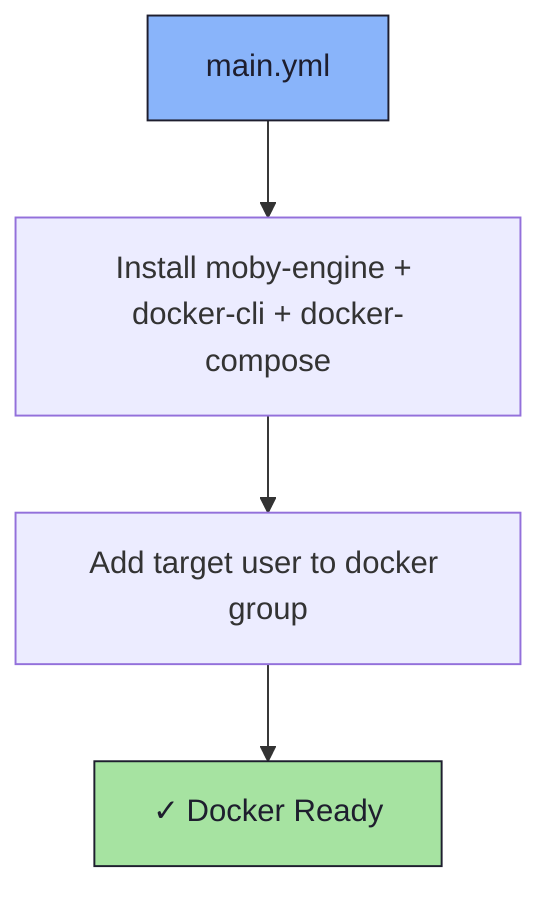

# 🐋 Docker Role

An Ansible role for installing [Docker](https://www.docker.com/) (via the Fedora `moby-engine` packages) and configuring user group membership.

## 📦 What Gets Installed

### Packages
- `moby-engine` - Docker engine (open source Moby build)
- `docker-cli` - Docker command-line interface
- `docker-compose` - Multi-container orchestration tool

## 🏗️ Role Architecture



## 📚 Dependencies

No role dependencies.

## 🚀 Usage

```bash
ansible-playbook main.yml -t docker
```

## 📝 Notes

- The user is added to the `docker` group so rootless `docker` commands work without `sudo`.
- A logout/login is required for the group change to take effect in an existing session.
