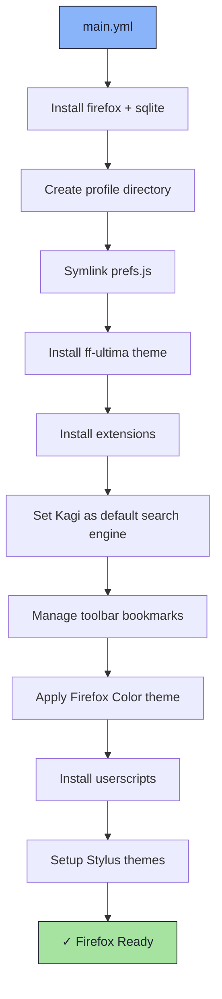

# 🦊 Firefox Role

An Ansible role for installing and fully configuring [Firefox](https://www.mozilla.org/firefox/), including extensions, search engine, bookmarks, a custom UI theme, and Stylus/userscript setup.

## 📦 What Gets Installed

### Packages
- `firefox` - Mozilla Firefox browser
- `sqlite` - SQLite CLI (for bookmark management)
- `python3-lz4` - LZ4 Python library (for search engine config)

### Extensions
- `ublock-origin` - Content blocker
- `bitwarden-password-manager` - Password manager
- `styl-us` - Custom CSS injector
- `firefox-color` - Firefox UI theme
- `sponsorblock` - YouTube sponsor skip
- `dearrow` - YouTube title/thumbnail improvement
- `violentmonkey` - Userscript manager
- `linkclump-for-firefox` - Multi-link selection
- `webserial-for-firefox` - Web Serial API support

### Configuration Files
- `~/.config/mozilla/firefox/<profile>/prefs.js` - Firefox user preferences
- `~/Downloads/stylus-themes.json` - Stylus theme import file

## 🏗️ Role Architecture



## 📚 Dependencies

No role dependencies.

**Variables** (`vars/main.yml`):
- `profile` / `profile_num` - Firefox profile name and ID
- `firefox_extensions` - List of AMO extension slugs to install
- `firefox_bookmarks` - List of toolbar bookmark objects (`name`, `url`, `keyword`)
- `default_search_engine` - Search engine name to set as default
- `kagi_search_url` - Kagi search URL template (Ansible Vault encrypted)
- `firefox_color` - Firefox Color theme URL
- `userscripts` - List of userscript install URLs

## 🚀 Usage

```bash
ansible-playbook main.yml -t firefox
```

## 📝 Notes

- `kagi_search_url` is encrypted with Ansible Vault — run with `--ask-vault-pass` or a configured vault password file.
- The search engine task requires Firefox to have been launched at least once so `search.json.mozlz4` exists in the profile.
- Stylus themes are placed in `~/Downloads/` for manual import via the Stylus extension UI.
