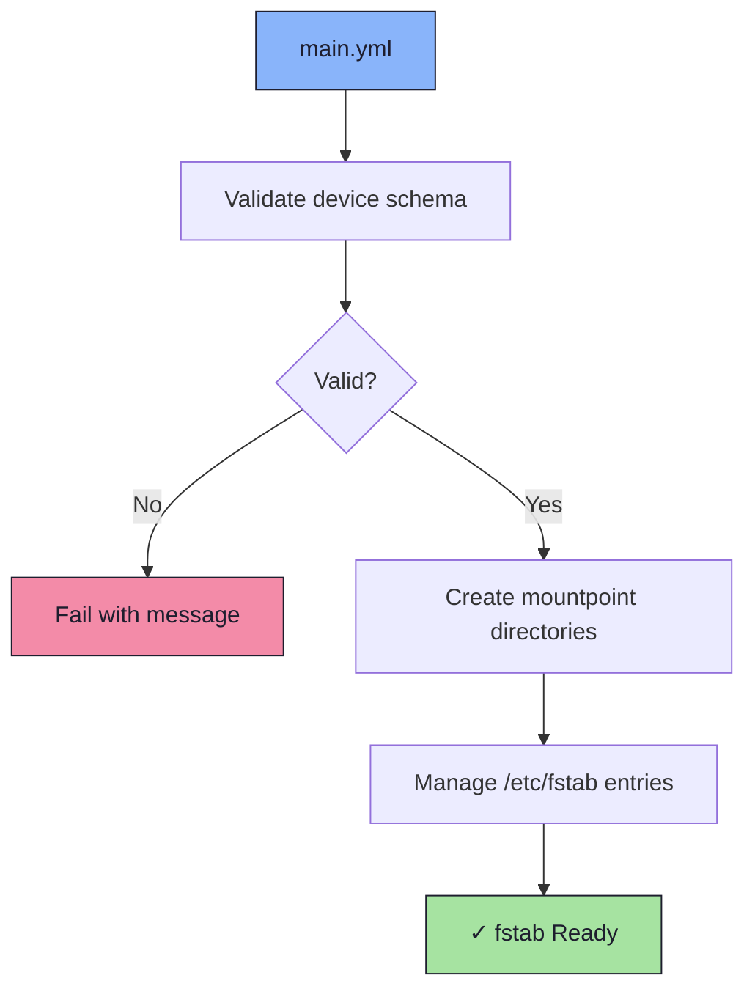

# 📁 Fstab Role

An Ansible role for declaratively managing `/etc/fstab` entries. Device identifiers are stored as Ansible Vault secrets and validated before any changes are applied.

## 📦 What Gets Installed

No packages are installed. This role manages system configuration only.

### Managed Entries
- `/mnt/nvme1` - Secondary NVMe drive (ext4)
- `/mnt/nvme2` - Additional NVMe drive (ext4)
- `/nfs/cloud` - NFS cloud share
- `/nfs/media` - NFS media share

## 🏗️ Role Architecture



## 📚 Dependencies

No role dependencies.

**Variables** (`defaults/main.yml`):
- `devices` - List of fstab entry objects, each requiring:
  - `device` - Block device or NFS path (supports Ansible Vault)
  - `mountpoint` - Target mount path
  - `filesystem` - Filesystem type (e.g. `ext4`, `nfs`, `swap`)
  - `options` - Mount options string
  - `backup` - dump value (integer)
  - `check` - fsck pass order (integer, optional)

## 🚀 Usage

```bash
ansible-playbook main.yml -t fstab
```

## 📝 Notes

- Device paths are encrypted with Ansible Vault — run with `--ask-vault-pass` or a configured vault password file.
- Entries are idempotent: re-running will not duplicate lines.
- Each entry is validated via `mount -fav` before being written.
