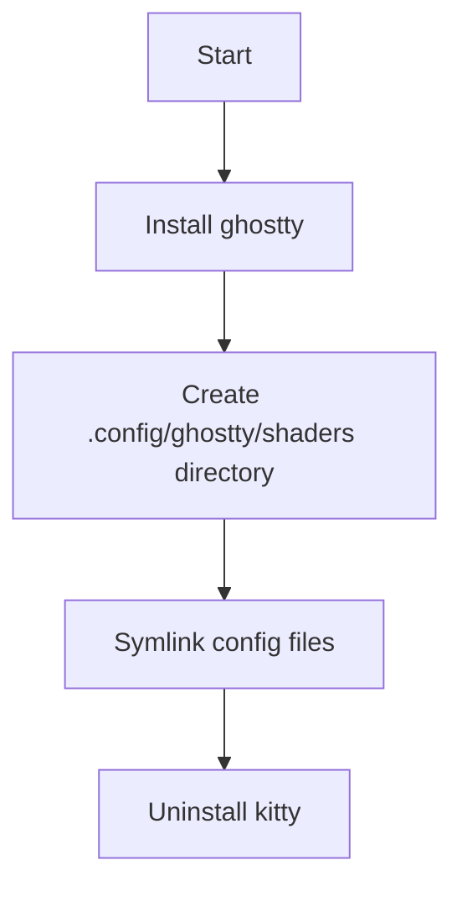

# ghostty

Terminal emulator that replaces kitty.

## Process

```mermaid
flowchart TD
    A[Start] --> B[Install ghostty]
    B --> C[Create .config/ghostty/shaders directory]
    C --> D[Symlink config files]
    D --> E[Uninstall kitty]
```
