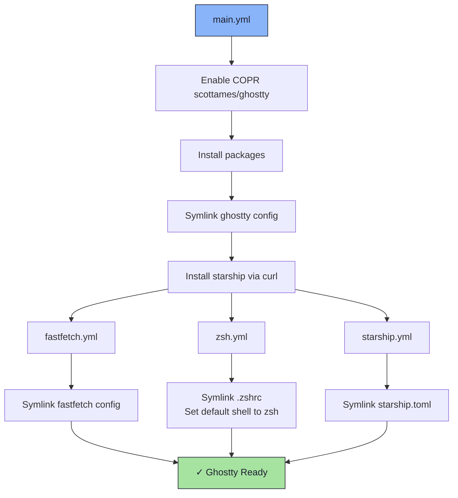

# 👻 Ghostty Role

An Ansible role for installing and configuring the [Ghostty](https://ghostty.org/) terminal emulator along with a full shell environment: zsh, [Starship](https://starship.rs/) prompt, and [fastfetch](https://github.com/fastfetch-cli/fastfetch).

## 📦 What Gets Installed

### Packages
- `ghostty` - GPU-accelerated terminal emulator (via COPR `scottames/ghostty`)
- `zsh` - Z shell
- `fzf` - Fuzzy finder
- `eza` - Modern `ls` replacement
- `thefuck` - Command correction tool
- `bat` - `cat` with syntax highlighting
- `fastfetch` - System information display
- `wget2` - Wget modernized

### Installers
- `starship` - Cross-shell prompt (installed via official install script)

### Configuration Files
- `~/.config/ghostty/` - Ghostty configuration and themes
- `~/.zshrc` - Zsh configuration (symlinked)
- `~/.config/starship/starship.toml` - Starship prompt config (symlinked)
- `~/.config/fastfetch/` - Fastfetch configuration (symlinked)

## 🏗️ Role Architecture



## 📚 Dependencies

No role dependencies.

## 🚀 Usage

```bash
# Full role
ansible-playbook main.yml -t ghostty

# Individual sub-components
ansible-playbook main.yml -t fastfetch
ansible-playbook main.yml -t zsh
ansible-playbook main.yml -t starship
```
