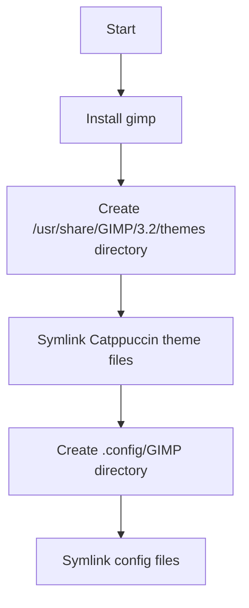

# gimp

Image editor with Catppuccin theme.

## Process

```mermaid
flowchart TD
    A[Start] --> B[Install gimp]
    B --> C[Create /usr/share/GIMP/3.2/themes directory]
    C --> D[Symlink Catppuccin theme files]
    D --> E[Create .config/GIMP directory]
    E --> F[Symlink config files]
```
