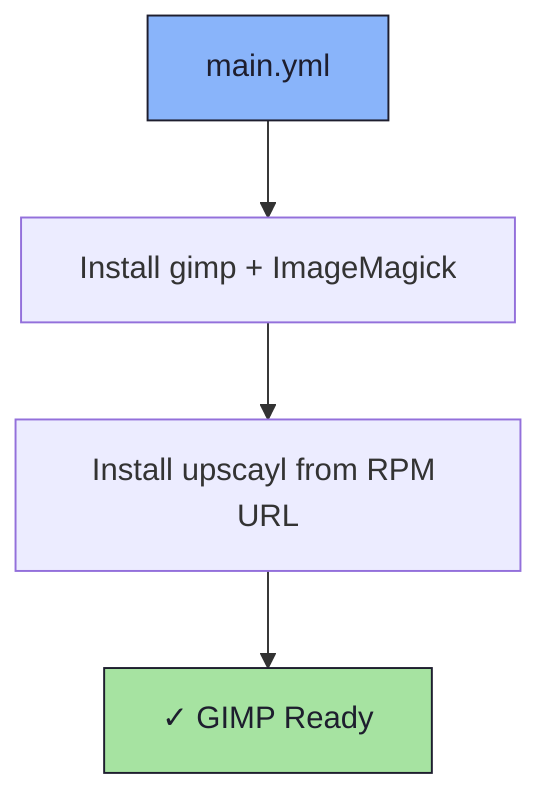

# 🎨 GIMP Role

An Ansible role for installing [GIMP](https://www.gimp.org/) along with image processing utilities.

## 📦 What Gets Installed

### Packages
- `gimp` - GNU Image Manipulation Program
- `ImageMagick` - Command-line image processing suite
- `upscayl` - AI image upscaler (installed from GitHub release RPM)

## 🏗️ Role Architecture



## 📚 Dependencies

No role dependencies.

**Variables** (`defaults/main.yml`):
- `gimp_packages` - DNF packages to install
- `gimp_rpm_urls` - Direct RPM URLs to install (GPG check disabled)

## 🚀 Usage

```bash
ansible-playbook main.yml -t gimp
```
