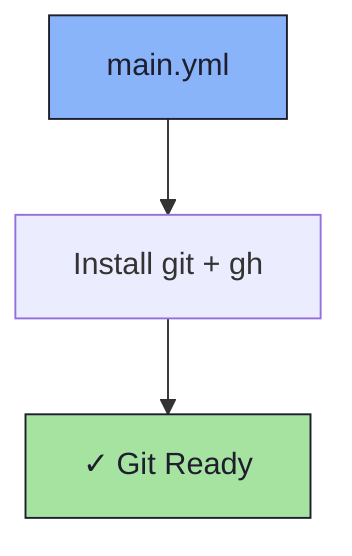

# 🔧 Git Role

An Ansible role for installing Git and the [GitHub CLI](https://cli.github.com/).

## 📦 What Gets Installed

### Packages
- `git` - Distributed version control system
- `gh` - GitHub CLI

## 🏗️ Role Architecture



## 📚 Dependencies

No role dependencies.

## 🚀 Usage

```bash
ansible-playbook main.yml -t git
```
