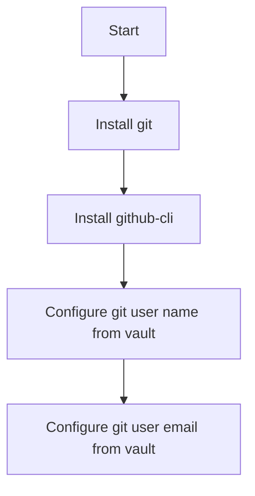

# git

Version control with GitHub CLI and user configuration.

## Process

```mermaid
flowchart TD
    A[Start] --> B[Install git]
    B --> C[Install github-cli]
    C --> D[Configure git user name from vault]
    D --> E[Configure git user email from vault]
```
