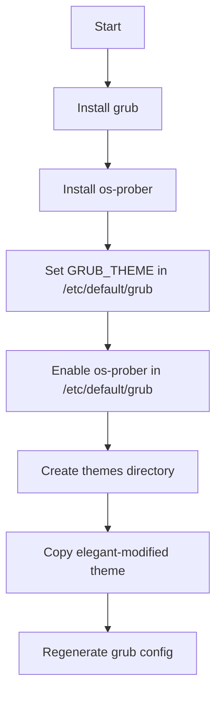

# grub

Bootloader with custom theme and os-prober enabled.

## Process

```mermaid
flowchart TD
    A[Start] --> B[Install grub]
    B --> C[Install os-prober]
    C --> D[Set GRUB_THEME in /etc/default/grub]
    D --> E[Enable os-prober in /etc/default/grub]
    E --> F[Create themes directory]
    F --> G[Copy elegant-modified theme]
    G --> H[Regenerate grub config]
```
