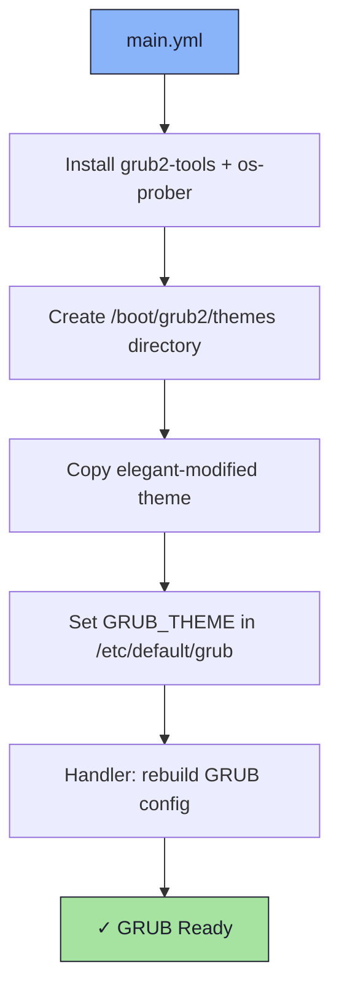

# 🥾 GRUB Role

An Ansible role for installing GRUB utilities and deploying a custom boot theme.

## 📦 What Gets Installed

### Packages
- `grub2-tools` - GRUB2 management utilities
- `os-prober` - Detects other operating systems for multi-boot

### Theme Files
- `/boot/grub2/themes/elegant-modified/` - Custom GRUB theme (deployed to boot partition)

## 🏗️ Role Architecture



## 📚 Dependencies

No role dependencies.

**Handlers** (`handlers/main.yml`):
- `grub | rebuild config` - Triggered on package install, theme copy, or config change

## 🚀 Usage

```bash
ansible-playbook main.yml -t grub
```
