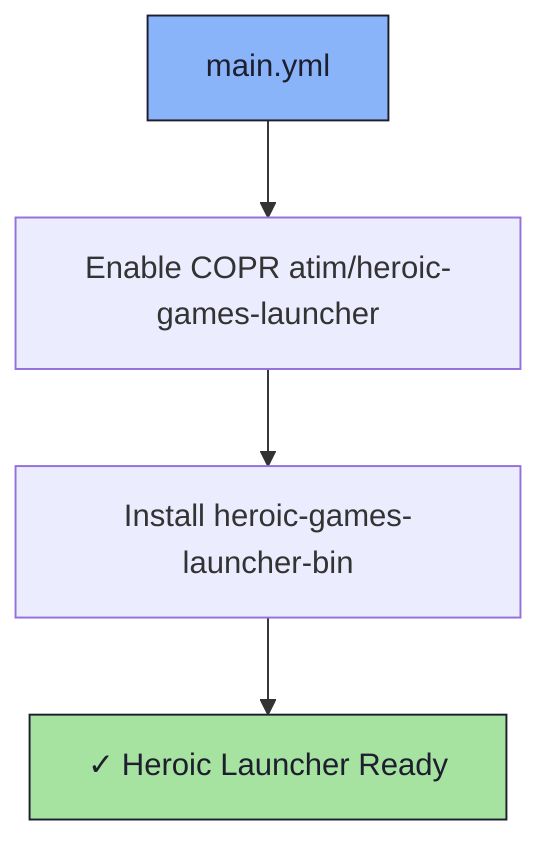

# 🎮 Heroic Launcher Role

An Ansible role for installing the [Heroic Games Launcher](https://heroicgameslauncher.com/) — an open-source launcher for Epic Games, GOG, and Amazon Games.

## 📦 What Gets Installed

### Packages
- `heroic-games-launcher-bin` - Heroic Games Launcher (via COPR `atim/heroic-games-launcher`)

## 🏗️ Role Architecture



## 📚 Dependencies

No role dependencies.

## 🚀 Usage

```bash
ansible-playbook main.yml -t heroic-games-launcher-bin
```
