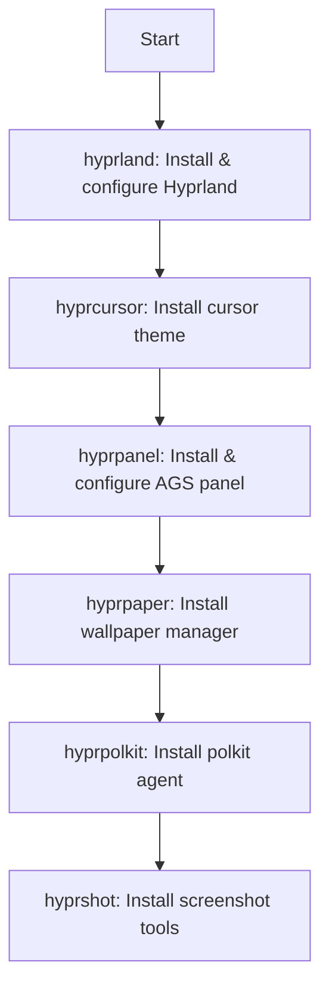

# hypr

Hyprland Wayland compositor with full ecosystem.

## Process

## Components

- **hyprland**: Core compositor with templated configs
- **hyprcursor**: Catppuccin cursor theme
- **hyprpanel**: AGS-based status bar
- **hyprpaper**: Wallpaper daemon
- **hyprpolkit**: Authentication agent
- **hyprshot**: Screenshot utilities (grim + slurp)
