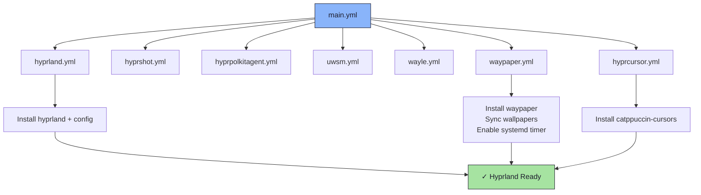

# 🪟 Hyprland Role

An Ansible role for installing and configuring the [Hyprland](https://hyprland.org/) Wayland compositor and its associated utilities.

## 📦 What Gets Installed

### Packages
- `hyprland` - Dynamic tiling Wayland compositor
- `hyprshot` - Screenshot utility for Hyprland
- `hyprpolkitagent` - Polkit authentication agent
- `uwsm` - Universal Wayland Session Manager
- `wayle` - Top bar for Hyprland
- `catppuccin-cursors` - Catppuccin cursor theme
- `hyprpaper` - Wallpaper utility for Hyprland (via COPR `lionheartp/Hyprland`)
- `waypaper` - GUI wallpaper manager with sync support

### Configuration Files
- `~/.config/hypr/` - Hyprland configuration (Lua-based)
- `~/.config/waypaper/` - Waypaper configuration
- `~/.config/wayle/config.toml` - Wayle bar configuration
- `~/.local/bin/e6-wallpaper-sync` - Wallpaper sync script
- `~/.config/systemd/user/waypaper.{service,timer}` - Wallpaper rotation systemd units

## 🏗️ Role Architecture



## 📚 Dependencies

No role dependencies.

**Repositories required**:
- COPR: `lionheartp/Hyprland` (for hyprpaper)

## 🚀 Usage

```bash
# Full role
ansible-playbook main.yml -t hyprland

# Individual sub-components
ansible-playbook main.yml -t waypaper
ansible-playbook main.yml -t hyprcursor
ansible-playbook main.yml -t uwsm
```

## 📝 Notes

- Monitor configuration is generated from a Jinja2 template (`templates/monitor.lua.j2`) using variables from `group_vars`.
- Wallpaper sync requires valid `wallpapers.e621` credentials in `group_vars/all.yml` (Ansible Vault encrypted).