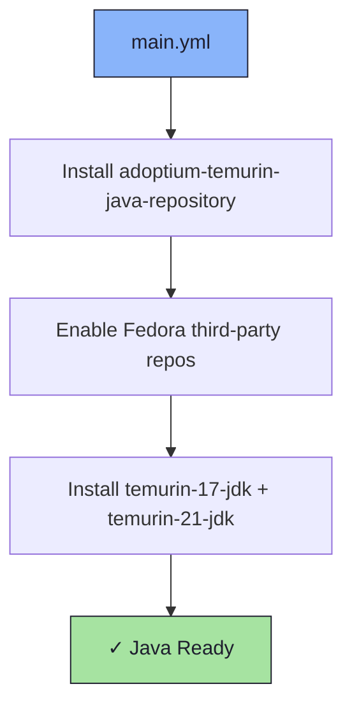

# ☕ Java Role

An Ansible role for installing [Eclipse Temurin](https://adoptium.net/) JDKs via the Adoptium repository.

## 📦 What Gets Installed

### Packages
- `temurin-17-jdk` - Eclipse Temurin JDK 17 (LTS)
- `temurin-21-jdk` - Eclipse Temurin JDK 21 (LTS)

## 🏗️ Role Architecture



## 📚 Dependencies

No role dependencies.

## 🚀 Usage

```bash
ansible-playbook main.yml -t java
```
