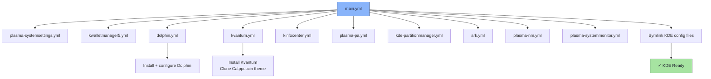

# 🐬 KDE Role

An Ansible role for installing KDE Plasma applications and utilities, including Dolphin file manager, Kvantum theme engine, and various Plasma components.

## 📦 What Gets Installed

### Packages
- `dolphin` - KDE file manager
- `ffmpegthumbs` - Video thumbnail support for Dolphin
- `kdegraphics-thumbnailers` - Image thumbnail support
- `kio-admin` - Admin file operations in Dolphin
- `kf6-baloo-file` - File indexing service
- `kvantum` - SVG-based Qt theme engine
- `qt6-qtwayland` - Wayland platform plugin
- `plasma-systemsettings` - KDE System Settings
- `redhat-menus` - System menu definitions used by KDE's application database
- `kwalletmanager5` - KWallet manager
- `kinfocenter` - System information viewer
- `plasma-pa` - PulseAudio/PipeWire volume control
- `kde-partitionmanager` - Disk partition manager
- `ark` - Archive manager
- `plasma-nm` - Network Manager applet
- `plasma-systemmonitor` - System resource monitor

### Configuration Files
- `~/.config/kdeglobals` - KDE global theme settings
- `~/.config/dolphinrc` - Dolphin configuration
- `~/.config/mimeapps.list` - File type associations
- `~/.config/Kvantum/kvantum.kvconfig` - Kvantum theme config
- `~/.config/Kvantum/catppuccin-mocha-sky/` - Catppuccin Mocha theme (cloned)

## 🏗️ Role Architecture



## 📚 Dependencies

No role dependencies.

## 🚀 Usage

```bash
ansible-playbook main.yml -t kde
```
