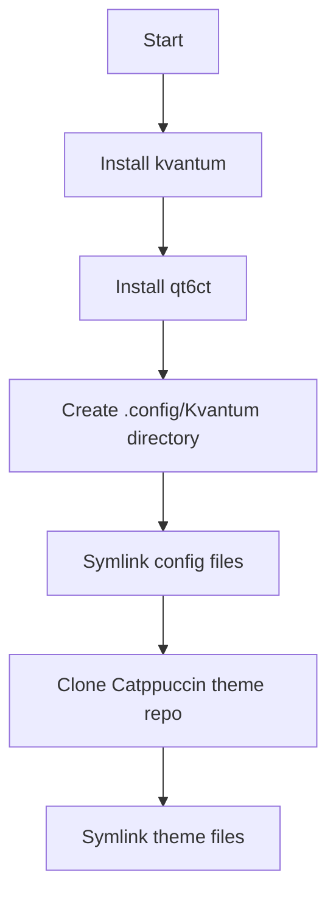

# kvantum

Qt theme engine with Catppuccin theme.

## Process

```mermaid
flowchart TD
    A[Start] --> B[Install kvantum]
    B --> C[Install qt6ct]
    C --> D[Create .config/Kvantum directory]
    D --> E[Symlink config files]
    E --> F[Clone Catppuccin theme repo]
    F --> G[Symlink theme files]
```
