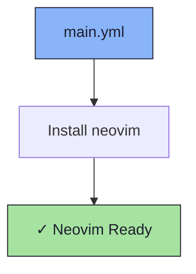

# ✏️ Neovim Role

An Ansible role for installing [Neovim](https://neovim.io/).

## 📦 What Gets Installed

### Packages
- `neovim` - Hyperextensible Vim-based text editor

## 🏗️ Role Architecture



## 📚 Dependencies

No role dependencies.

## 🚀 Usage

```bash
ansible-playbook main.yml -t neovim
```
