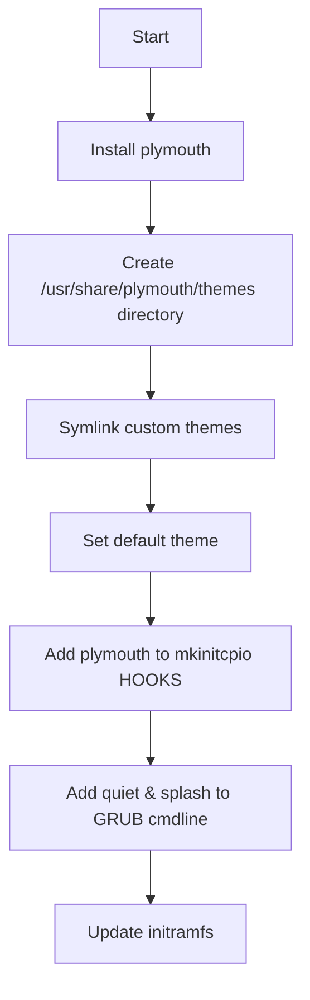

# plymouth

Boot splash screen with custom theme.

## Process

```mermaid
flowchart TD
    A[Start] --> B[Install plymouth]
    B --> C[Create /usr/share/plymouth/themes directory]
    C --> D[Symlink custom themes]
    D --> E[Set default theme]
    E --> F[Add plymouth to mkinitcpio HOOKS]
    F --> G[Add quiet & splash to GRUB cmdline]
    G --> H[Update initramfs]
```
