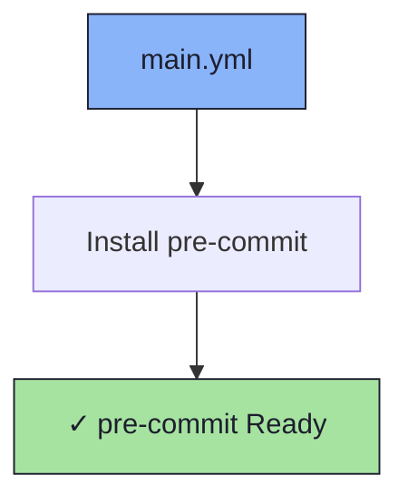

# 🔒 Pre-commit Role

An Ansible role for installing [pre-commit](https://pre-commit.com/) — a framework for managing and maintaining multi-language pre-commit hooks.

## 📦 What Gets Installed

### Packages
- `pre-commit` - Git hook management framework

## 🏗️ Role Architecture



## 📚 Dependencies

No role dependencies.

## 🚀 Usage

```bash
ansible-playbook main.yml -t pre-commit
```

## 📝 Notes

This repo enforces [Conventional Commits](https://www.conventionalcommits.org/) via `.pre-commit-config.yaml`. After installation, run `pre-commit install --hook-type commit-msg` in any repo to activate the hooks.
