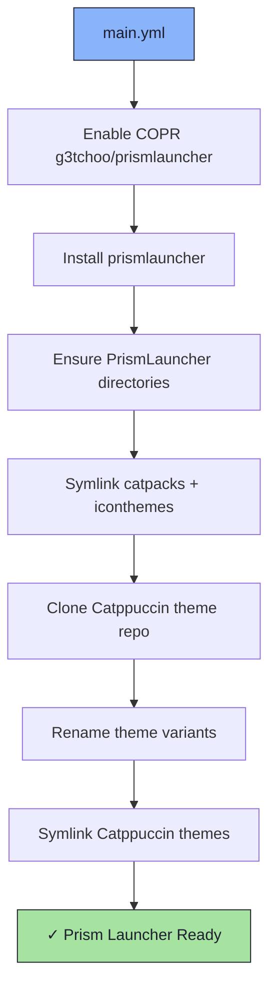

# ⛏️ Prism Launcher Role

An Ansible role for installing [Prism Launcher](https://prismlauncher.org/) — an open-source Minecraft launcher — with Catppuccin themes and icon sets.

## 📦 What Gets Installed

### Packages
- `prismlauncher` - Open-source Minecraft launcher (via COPR `g3tchoo/prismlauncher`)

### Themes & Assets
- Catppuccin themes (all flavors and accents, cloned from [catppuccin/prismlauncher](https://github.com/catppuccin/prismlauncher))
- NerdFonts Catppuccin Mocha icon theme (bundled)
- Custom catpacks

### Configuration Paths
- `~/.local/share/PrismLauncher/catpacks/` - Cat pack assets
- `~/.local/share/PrismLauncher/iconthemes/` - Icon themes
- `~/.local/share/PrismLauncher/themes/` - UI themes (Catppuccin variants)

## 🏗️ Role Architecture



## 📚 Dependencies

No role dependencies.

## 🚀 Usage

```bash
ansible-playbook main.yml -t prismlauncher
```
