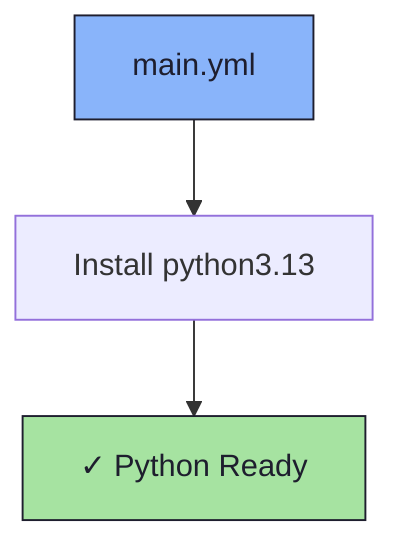

# 🐍 Python Role

An Ansible role for installing Python 3.

## 📦 What Gets Installed

### Packages
- `python3.13` - Python 3.13 interpreter

## 🏗️ Role Architecture



## 📚 Dependencies

No role dependencies.

## 🚀 Usage

```bash
ansible-playbook main.yml -t python3-13
```
