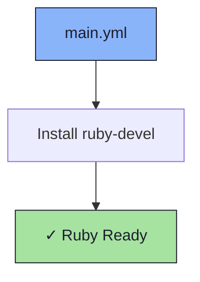

# 💎 Ruby Role

An Ansible role for installing Ruby development headers.

## 📦 What Gets Installed

### Packages
- `ruby-devel` - Ruby development libraries and headers

## 🏗️ Role Architecture



## 📚 Dependencies

No role dependencies.

## 🚀 Usage

```bash
ansible-playbook main.yml -t ruby-devel
```
