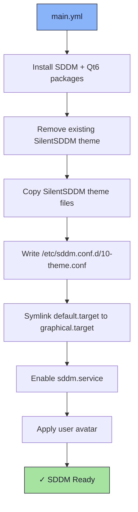

# 🔐 SDDM Role

An Ansible role for installing and configuring [SDDM](https://github.com/sddm/sddm) display manager with the [SilentSDDM](https://github.com/nicehash/SilentSDDM) theme.

## 📦 What Gets Installed

### Packages
- `sddm` - Simple Desktop Display Manager
- `sddm-conf` - SDDM configuration tool
- `sddm-wayland-miriway` - Wayland compositor backend for SDDM
- `plymouth` - Graphical boot splash
- `qt6-qtsvg` - SVG support for Qt6
- `qt6-qtvirtualkeyboard` - On-screen keyboard
- `qt6-qtmultimedia` - Multimedia support (video backgrounds)
- `qt6-qtimageformats` - Extended image format support

### Theme Files
- `/usr/share/sddm/themes/SilentSDDM/` - SilentSDDM theme (full theme directory)
- `/etc/sddm.conf.d/10-theme.conf` - SDDM theme configuration

## 🏗️ Role Architecture



## 📚 Dependencies

No role dependencies.

**Variables** (`defaults/main.yml`):
- `sddm_theme_name` - Theme name (`SilentSDDM`)
- `sddm_theme_dir` - Theme installation path
- `sddm_packages` - List of packages to install

## 🚀 Usage

```bash
ansible-playbook main.yml -t sddm
```

## 📝 Notes

- The theme directory is fully replaced on each run to ensure clean state.
- Multiple background presets are bundled (`furglitch`, `rei`, `silvia`, `ken`, `mountain`, etc.).
- The active background is configured in `configs/furglitch.conf`.
