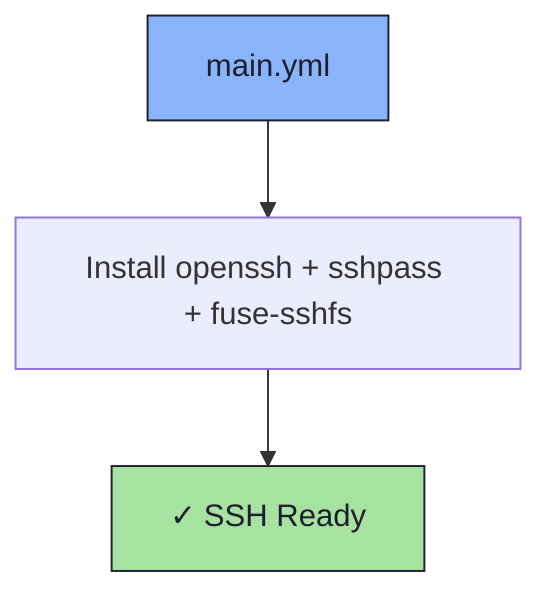

# 🔑 SSH Role

An Ansible role for installing SSH client tools.

## 📦 What Gets Installed

### Packages
- `openssh` - OpenSSH client and utilities
- `sshpass` - Non-interactive SSH password authentication
- `fuse-sshfs` - Mount remote filesystems over SSH via FUSE

## 🏗️ Role Architecture



## 📚 Dependencies

No role dependencies.

## 🚀 Usage

```bash
ansible-playbook main.yml -t ssh
```
