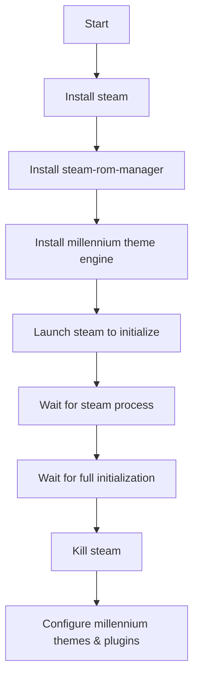

# steam

Steam gaming platform with Millennium theme engine.

## Process

```mermaid
flowchart TD
    A[Start] --> B[Install steam]
    B --> C[Install steam-rom-manager]
    C --> D[Install millennium theme engine]
    D --> E[Launch steam to initialize]
    E --> F[Wait for steam process]
    F --> G[Wait for full initialization]
    G --> H[Kill steam]
    H --> I[Configure millennium themes & plugins]
```

## Millennium

Millennium is a theme engine for Steam. Themes and plugins are symlinked from role files.
