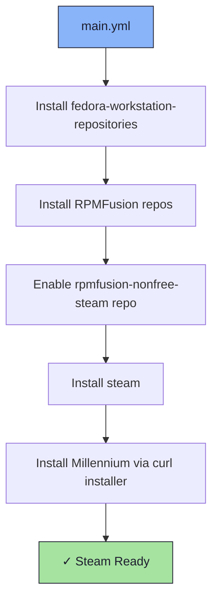

# 🎮 Steam Role

An Ansible role for installing [Steam](https://store.steampowered.com/) and [Millennium](https://steambrew.app/) — the Steam mod loader.

## 📦 What Gets Installed

### Packages
- `fedora-workstation-repositories` - Enables Fedora workstation third-party repos
- `steam` - Steam gaming platform (via RPMFusion nonfree steam repo)

### Installers
- `millennium` - Steam mod loader (installed via official install script)

## 🏗️ Role Architecture



## 📚 Dependencies

No role dependencies.

**Repositories required**:
- RPMFusion free + nonfree
- rpmfusion-nonfree-steam (enabled explicitly via `dnf config-manager`)

## 🚀 Usage

```bash
ansible-playbook main.yml -t steam
```
