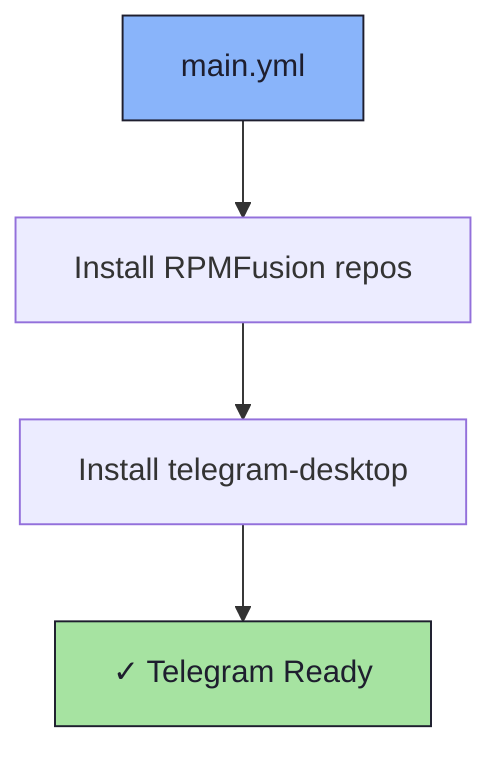

# ✈️ Telegram Role

An Ansible role for installing [Telegram Desktop](https://desktop.telegram.org/).

## 📦 What Gets Installed

### Packages
- `telegram-desktop` - Telegram messaging client (via RPMFusion nonfree)

## 🏗️ Role Architecture



## 📚 Dependencies

No role dependencies.

**Repositories required**:
- RPMFusion free + nonfree

## 🚀 Usage

```bash
ansible-playbook main.yml -t telegram-desktop
```
