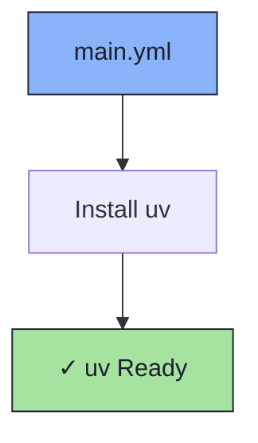

# ⚡ uv Role

An Ansible role for installing [uv](https://github.com/astral-sh/uv) — an extremely fast Python package and project manager.

## 📦 What Gets Installed

### Packages
- `uv` - Fast Python package manager and installer

## 🏗️ Role Architecture



## 📚 Dependencies

No role dependencies.

## 🚀 Usage

```bash
ansible-playbook main.yml -t uv
```
