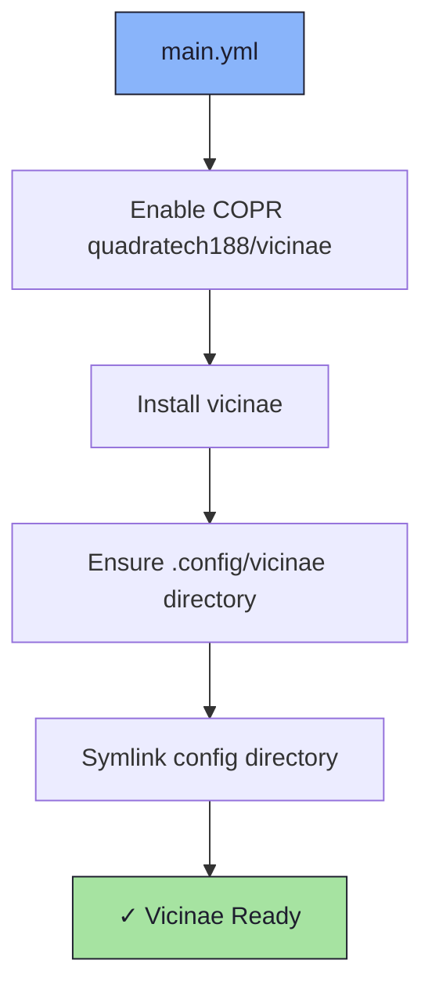

# 🏘️ Vicinae Role

An Ansible role for installing and configuring [Vicinae](https://codeberg.org/quadratech/vicinae) — a neighborhood/network utility.

## 📦 What Gets Installed

### Packages
- `vicinae` - Network neighborhood utility (via COPR `quadratech188/vicinae`)

### Configuration Files
- `~/.config/vicinae/` - Vicinae configuration directory (symlinked)

## 🏗️ Role Architecture



## 📚 Dependencies

No role dependencies.

## 🚀 Usage

```bash
ansible-playbook main.yml -t vicinae
```