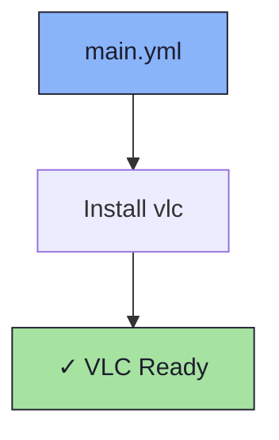

# 📺 VLC Role

An Ansible role for installing [VLC media player](https://www.videolan.org/vlc/).

## 📦 What Gets Installed

### Packages
- `vlc` - Cross-platform multimedia player

## 🏗️ Role Architecture



## 📚 Dependencies

No role dependencies.

## 🚀 Usage

```bash
ansible-playbook main.yml -t vlc
```
