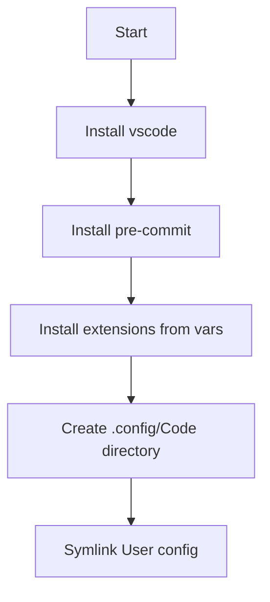

# vscode

Visual Studio Code with extensions and configuration.

## Process

```mermaid
flowchart TD
    A[Start] --> B[Install vscode]
    B --> C[Install pre-commit]
    C --> D[Install extensions from vars]
    D --> E[Create .config/Code directory]
    E --> F[Symlink User config]
```
