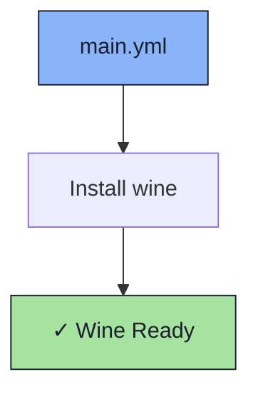

# 🍷 Wine Role

An Ansible role for installing [Wine](https://www.winehq.org/) — a compatibility layer for running Windows applications on Linux.

## 📦 What Gets Installed

### Packages
- `wine` - Windows compatibility layer

## 🏗️ Role Architecture



## 📚 Dependencies

No role dependencies.

## 🚀 Usage

```bash
ansible-playbook main.yml -t wine
```
