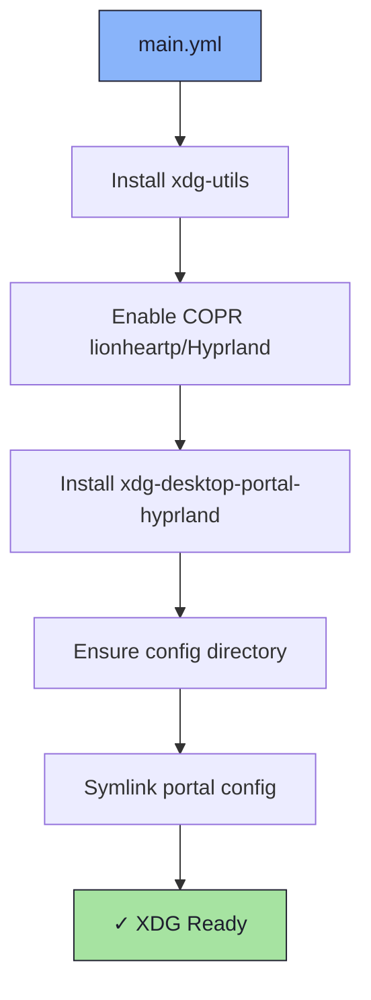

# 🌐 XDG Role

An Ansible role for installing XDG utilities and configuring the [xdg-desktop-portal-hyprland](https://github.com/hyprwm/xdg-desktop-portal-hyprland) for Wayland app integration.

## 📦 What Gets Installed

### Packages
- `xdg-utils` - XDG command-line tools
- `xdg-desktop-portal-hyprland` - XDG desktop portal backend for Hyprland (via COPR `lionheartp/Hyprland`)

### Configuration Files
- `~/.config/xdg-desktop-portal/` - Portal configuration (symlinked)
  - `portals.conf` - Portal backend selection

## 🏗️ Role Architecture



## 📚 Dependencies

No role dependencies.

**Repositories required**:
- COPR: `lionheartp/Hyprland`

## 🚀 Usage

```bash
ansible-playbook main.yml -t xdg
```