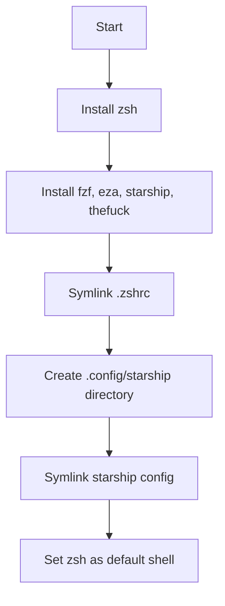

# zsh

Z shell with modern utilities and Starship prompt.

## Process

```mermaid
flowchart TD
    A[Start] --> B[Install zsh]
    B --> C[Install fzf, eza, starship, thefuck]
    C --> D[Symlink .zshrc]
    D --> E[Create .config/starship directory]
    E --> F[Symlink starship config]
    F --> G[Set zsh as default shell]
```
